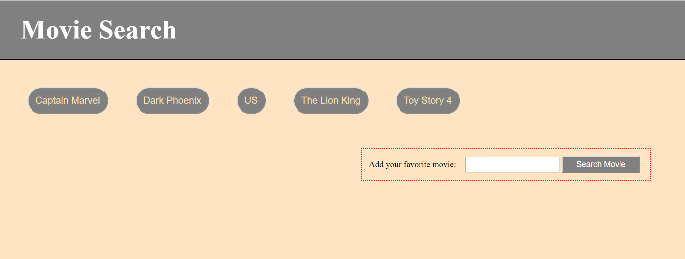
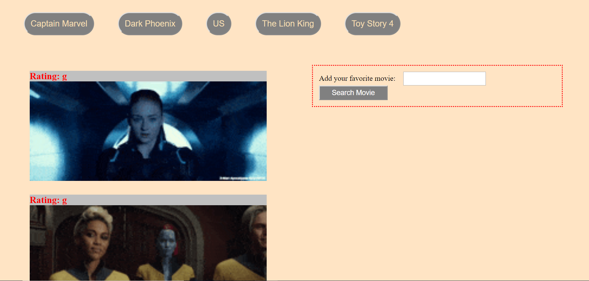
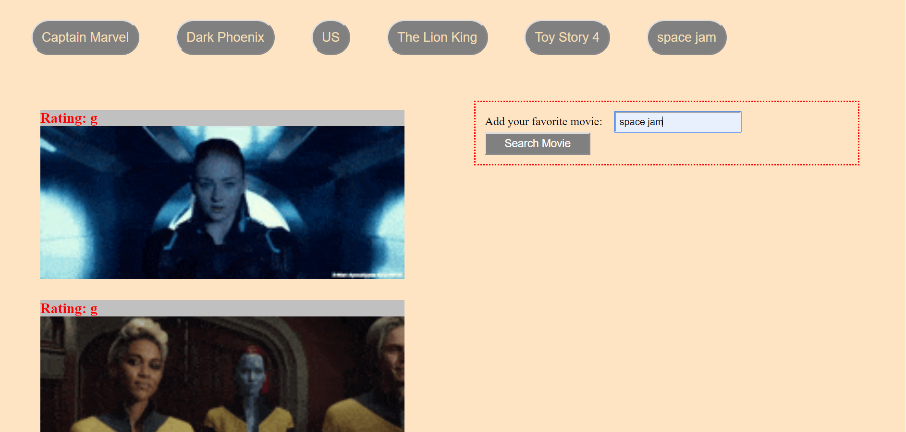

**
📘 GifTastic!!! 📘
**

 

**Instructions**

- When the user clicks on a button, the page should grab 10 static, non-animated gif images from the GIPHY API and place them on the page.

- When the user clicks one of the still GIPHY images, the gif animate. If the user clicks the gif again, it stop playing.

- Above every gif, display its rating (PG, G, so on).

- User can add their favorite movies as well by searching movie names.

 

**Screenshots**

 

 

 

**Built With**

- HTML 5
- CSS 3
- Javascript
- JQurey
- API
- JSON
- AJAX

 

**Images By**

Maneet Singh - https://github.com/Maneet97

 

**Author**

Maneet Singh - https://github.com/Maneet97

 

**License**

This project is licensed under the MIT License - see the https://github.com/Maneet97 file for details
